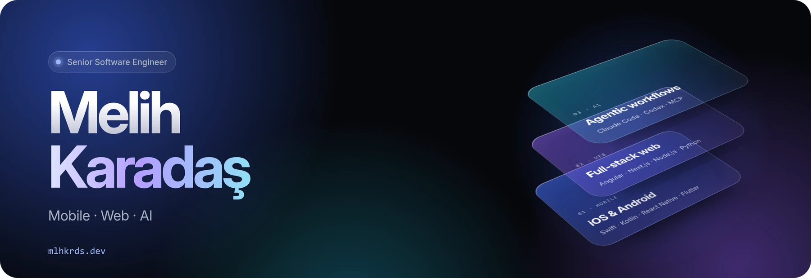
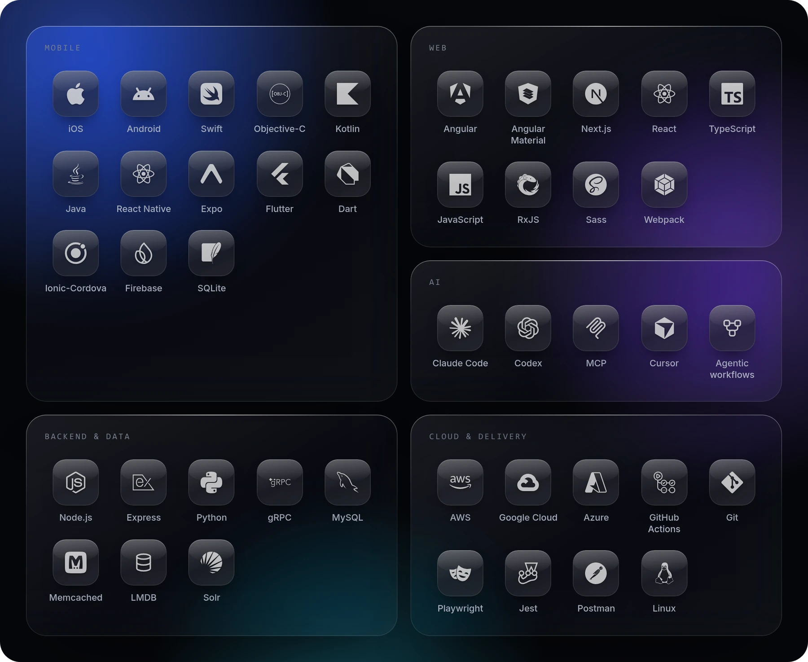

I develop and implement software across mobile, web, and artificial intelligence platforms, concentrating on scalability, speed, and development efficiency.

### About

I am a senior software engineer with experience across mobile, web and backend development. On mobile, my focus is SDK development: I design cross-platform SDKs with a native iOS and Android core and plugins for React Native, Flutter and Ionic-Cordova, integrated into apps used on millions of devices. Alongside SDKs, I also build mobile apps.

On the web, I built full-stack applications with Angular, Next.js, Node.js and Python, covering everything from server-side rendering to gRPC services and data layers on MySQL, Memcached and Solr. I also developed high-performance Web SDKs and REST APIs for real-time data.

Lately, I have been focusing on AI-assisted software development, building agentic workflows with Claude Code and Codex and helping my team make AI part of everyday engineering.

### What I work on

- **Mobile engineering:** Native iOS & Android using Swift & Kotlin, respectively, and Cross Platform applications along with Plugins in React Native, Expo, Flutter, and Ionic-Cordova.
- **Full-stack web:** Angular and Next.js UIs for server-side rendering; Node.js and Python applications through gRPC protocol; data storage in MySQL, Memcached, LMDB and Solr.
- **AI-assisted development:** Claude Code & Codex at the heart of everyday business, with customizations based on projects, Skills and MCP integration for the whole team within the company.
- **Architecture and performance:** Architectures that are modular and scalable, with a keen focus on memory efficiency and performance.
- **Developer experience:** Well-documented APIs, reusable UI components, and continuous integration and delivery with automated testing on every release.
- **Technical leadership:** Establishing technical standards and guidance for the team, ranging from system design to AI-assisted software development practices.

### Stack

### Contact

[mlhkrds.dev](https://mlhkrds.dev) · [LinkedIn](https://www.linkedin.com/in/melih-karadas/) · [X](https://x.com/mlhkrdsdev)
